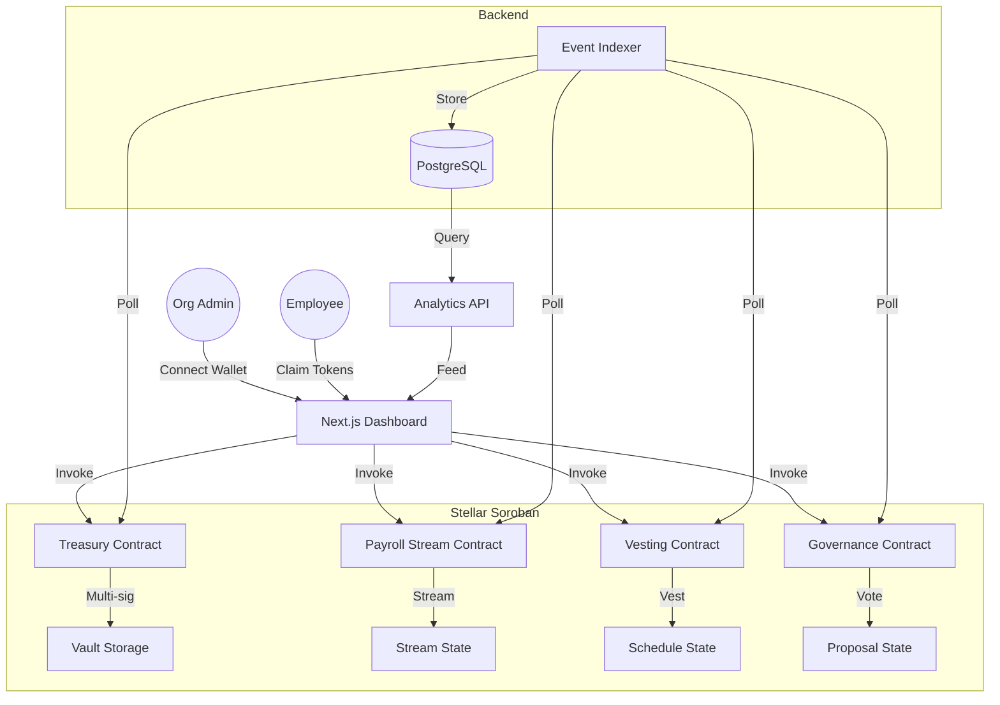

# OrbitPay

Decentralized Payroll, Vesting & Treasury Protocol on Stellar Soroban.

```
  ___       _     _ _   ____
 / _ \ _ __| |__ (_) |_|  _ \ __ _ _   _
| | | | '__| '_ \| | __| |_) / _` | | | |
| |_| | |  | |_) | | |_|  __/ (_| | |_| |
 \___/|_|  |_.__/|_|\__|_|   \__,_|\__, |
                                    |___/
```

**OrbitPay** is a protocol that enables startups, DAOs, and remote-first organizations to manage payroll, token vesting, and treasury operations entirely on-chain using Stellar Soroban smart contracts.

## 💡 The Idea

Build an on-chain DAO operations protocol:
- **Treasury**: Multi-signature vault with configurable approval thresholds
- **Payroll Streaming**: Continuous token distribution, claimable in real-time
- **Token Vesting**: Cliff + linear vesting for team, advisors, and investors
- **Governance**: On-chain budget proposals with quorum-based approval voting

This is not just payments — it is **programmable organizational finance**.

## 🏗️ Architecture



## 🛠 Tech Stack

| Layer | Technology |
|-------|-----------|
| **Smart Contracts** | Soroban (Rust), `soroban-sdk 22.0.0` |
| **Frontend** | Next.js 14, TypeScript, Tailwind CSS |
| **Wallet** | Freighter Wallet |
| **Indexing** | Custom Soroban-RPC event poller |
| **Database** | PostgreSQL, Redis |
| **CI/CD** | GitHub Actions |

## 📂 Repository Structure

```
OrbitPay/
├── contracts/                        # Soroban workspace
│   └── contracts/
│       ├── treasury/                 # Multi-sig treasury (8 issues)
│       ├── payroll_stream/           # Payment streaming (6 issues)
│       ├── vesting/                  # Cliff + linear vesting (6 issues)
│       └── governance/               # Proposals & voting (5 issues)
├── frontend/                         # Next.js dashboard
│   └── src/
│       ├── app/                      # Pages (treasury, payroll, vesting, governance)
│       ├── components/               # Reusable UI components
│       ├── hooks/                    # Contract interaction hooks
│       └── lib/                      # Network & wallet utilities
├── docs/                             # Issue trackers & guides
│   ├── ISSUES-SMARTCONTRACT.md       # 25 smart contract issues
│   ├── ISSUES-FRONTEND.md           # 25 frontend issues
│   ├── ISSUES-BACKEND.md            # 10 backend/indexer issues
│   ├── ISSUES-SDK-TOOLING.md        # 10 SDK/tooling issues
│   ├── SMARTCONTRACT_GUIDE.md       # Contract development guide
│   └── FRONTEND_GUIDE.md            # Frontend integration guide
├── CONTRIBUTING.md
├── CODE_OF_CONDUCT.md
├── MAINTAINERS.md
└── STYLE.md
```

## 🚀 Getting Started

### 1. Prerequisites

- **Rust & Cargo** (for smart contracts)
- **Soroban CLI**: `cargo install --locked soroban-cli`
- **Node.js v18+** (for frontend)
- **Freighter Wallet** browser extension

### 2. Installation

Clone the repository:
```bash
git clone https://github.com/YOUR_USERNAME/OrbitPay.git
cd OrbitPay
```

Verify contract integrity:
```bash
cd contracts
cargo build --all
cargo test --all
```

Setup frontend:
```bash
cd frontend
npm install
npm run dev
```

## 📚 Documentation & Trackers

We have separated our task lists for better organization. Please refer to the specific tracker for your area of contribution:

- 🧠 [Smart Contract Issues](docs/ISSUES-SMARTCONTRACT.md) — 25 issues across 4 contracts
- 🎨 [Frontend Issues](docs/ISSUES-FRONTEND.md) — 25 issues for the Next.js dashboard
- ⚙️ [Backend & Indexer Issues](docs/ISSUES-BACKEND.md) — 10 issues for the off-chain stack
- 🛠 [SDK & Tooling Issues](docs/ISSUES-SDK-TOOLING.md) — 10 issues for SDK, CLI, and DevOps

### Guides:
- 📘 [Smart Contract Guide](docs/SMARTCONTRACT_GUIDE.md)
- 🌐 [Frontend Integration Guide](docs/FRONTEND_GUIDE.md)

## 🤝 Contributing

We welcome contributions! Please see our [CONTRIBUTING.md](CONTRIBUTING.md) for details on our code of conduct and the development process.

**Quick Start for Contributors:**
1. Pick an issue from `docs/`
2. Fork the repo
3. Create a branch
4. Submit a PR!

---

Project maintained under the OrbitPay organization.
