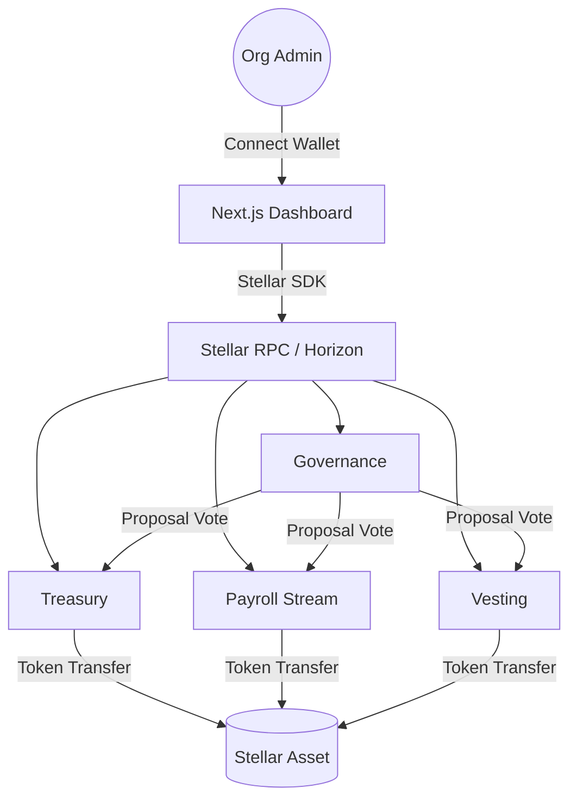
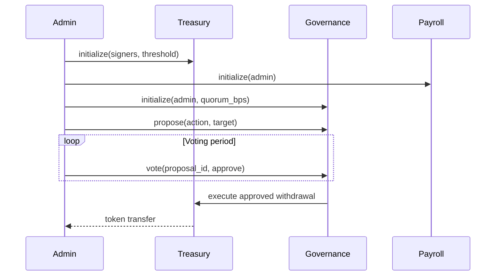

# OrbitPay — Architecture Overview

This document describes the on-chain smart contract architecture of OrbitPay and how the four Soroban contracts interact with the frontend and each other.

## Contract Dependency Diagram



## Contract Lifecycle



## Contract Summaries

### Treasury (`contracts/treasury`)

Multi-signature treasury vault.

- **`initialize(admin, signers, threshold)`** — sets up the vault with a list of authorized signers and an approval threshold.
- **`propose_withdrawal(to, token, amount)`** — creates a pending withdrawal request (requires signer auth).
- **`approve_withdrawal(request_id)`** — adds an approval; executes the transfer when threshold is reached.
- **`cancel_withdrawal(request_id)`** — cancels a pending request (admin only).

Related issues: [Smart Contract Issues](../ISSUES-SMARTCONTRACT.md)

### Payroll Stream (`contracts/payroll_stream`)

Continuous token streaming for payroll.

- **`initialize(admin)`** — one-time setup.
- **`create_stream(recipient, token, rate_per_second, start, end)`** — starts a payment stream.
- **`claim(stream_id)`** — recipient claims accrued tokens up to the current ledger timestamp.
- **`cancel_stream(stream_id)`** — admin can cancel and return unstreamed tokens.

### Vesting (`contracts/vesting`)

Cliff + linear vesting for team and advisors.

- **`initialize(admin)`** — one-time setup.
- **`create_schedule(recipient, token, total, cliff_ts, end_ts)`** — configures a vesting schedule.
- **`claim(schedule_id)`** — recipient claims vested tokens.
- **`revoke(schedule_id)`** — admin revokes unvested tokens.

### Governance (`contracts/governance`)

On-chain budget proposal voting.

- **`initialize(admin, quorum_bps)`** — sets quorum threshold (basis points of total votes needed).
- **`propose(description, target_contract, action)`** — creates a proposal.
- **`vote(proposal_id, approve)`** — casts a vote.
- **`execute(proposal_id)`** — executes a passed proposal after the voting period.

## Issue Tracker Cross-Reference

| Area | Tracker |
|------|---------|
| Smart Contracts | [ISSUES-SMARTCONTRACT.md](../ISSUES-SMARTCONTRACT.md) |
| Frontend | [ISSUES-FRONTEND.md](../ISSUES-FRONTEND.md) |
| Backend / Indexer | [ISSUES-BACKEND.md](../ISSUES-BACKEND.md) |
| SDK & Tooling | [ISSUES-SDK-TOOLING.md](../ISSUES-SDK-TOOLING.md) |

## Generating Docs Locally

```bash
cd contracts
cargo doc --no-deps --all --open
```

This builds rustdoc for all four contracts and opens the index in your browser. The CI workflow at `.github/workflows/docs.yml` runs the same command on every push to `main` and deploys the output to GitHub Pages.
